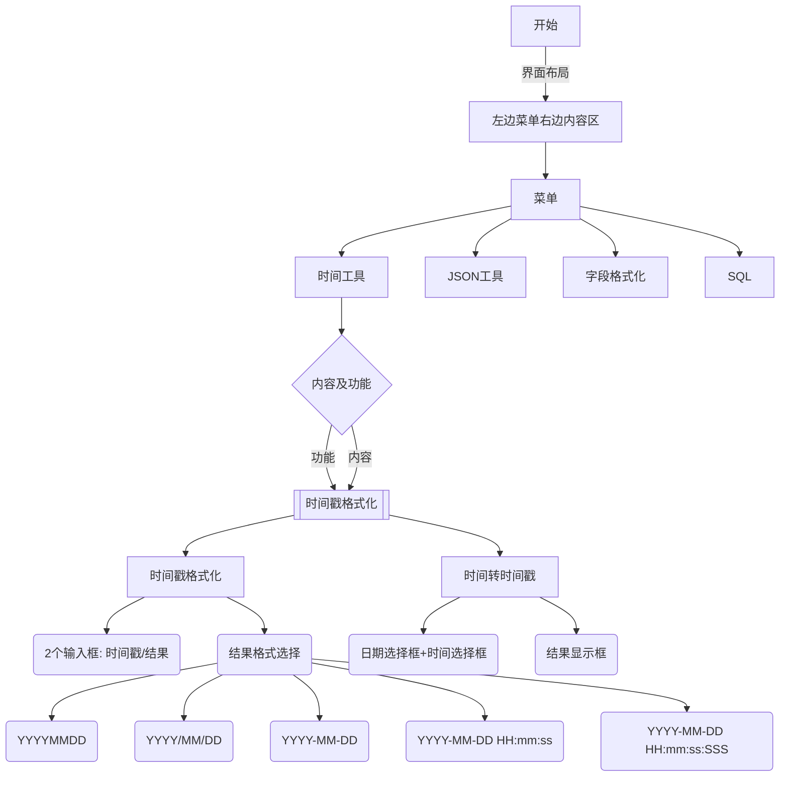

## 设计一个小工具

```mermaid
graph TD
    A[开始] --界面布局--> B[左边菜单右边内容区]
    %% 使用python语言，版本是3.14
    B --> C[菜单]
    C --> D1[时间工具]
    C --> D2[JSON工具]
    C --> D3[字段格式化]
    C --> D4[SQL]
    
    D1 -->E1{内容及功能}
    E1 --功能--> F1[[时间戳格式化]]
    E1 --内容-->F1
    F1-->F11[时间戳格式化]
    F11-->F111(2个输入框: 时间戳/结果)
    F11-->F112(结果格式选择)
    F112--> F1121(YYYYMMDD)
    F112--> F1122(YYYY/MM/DD)
    F112--> F1123(YYYY-MM-DD)
    F112--> F1124(YYYY-MM-DD HH:mm:ss)
    F112--> F1125(YYYY-MM-DD HH:mm:ss:SSS)
    F1-->F12[时间转时间戳]
    F12-->F121(日期选择框+时间选择框)    
    F12-->F122(结果显示框)    


```