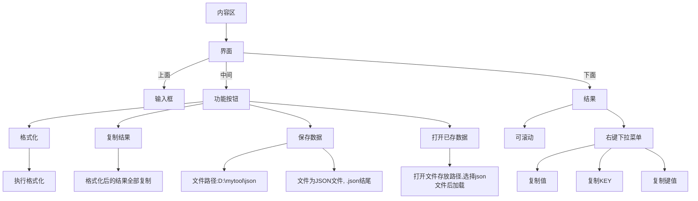

### JSON工具
    功能： 格式化json

```mermaid
flowchart TD
    A[内容区] -->B[界面]
    B -- 上面 --> C1[输入框]
    B -- 中间 --> C2[功能按钮]
    B -- 下面 --> C3[结果] 
    
    C3-->D1[可滚动]
    C3-->D2[右键下拉菜单]
    D2-->D21[复制值]
    D2-->D22[复制KEY]
    D2-->D23[复制键值]
    
    C2-->E1[格式化] --> E11[执行格式化]
    C2-->E2[复制结果] --> E21[格式化后的结果全部复制]
    C2-->E3[保存数据] 
    E3 --> E31[文件路径:D:\mytool\json]
    E3 --> E32[文件为JSON文件, .json结尾]
    C2-->E4[打开已存数据] --> E41[打开文件存放路径,选择json文件后加载]
    

 

```